## Introduction
This project is about developing a graphics engine by using C++. It aims to create an animation scene of Gandolf vs. Balrog in 3D yet cel-shading style, with technical goal of finding and implementing some rendering and simulating methods that help create models in a 2D cartoon way. It is written based on the code skeleton provided from class [CS488](https://student.cs.uwaterloo.ca/~cs488/Spring2024/).

## Implementation

### 1. Modeling
Blender was used to model two characters and their weapons, and texture maps were created for both.

  

    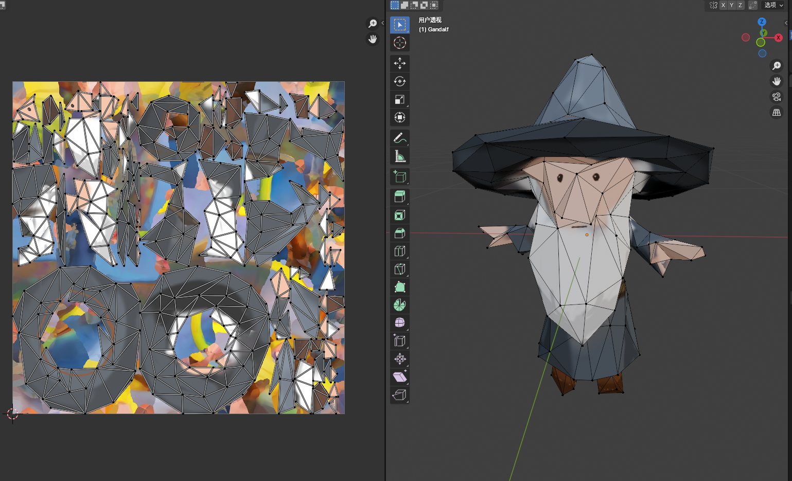
    
Gandalf

  

  

    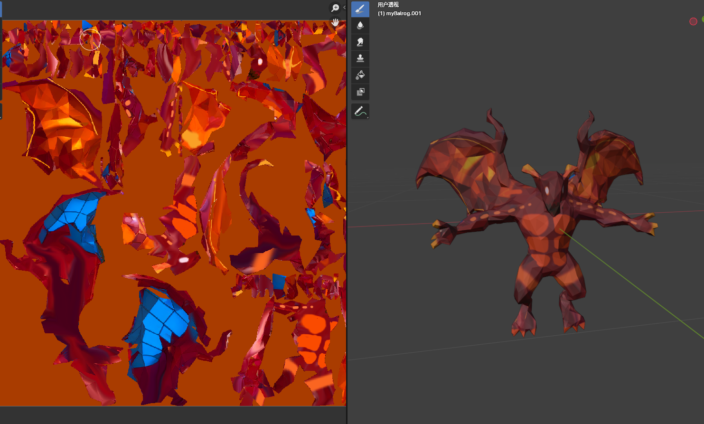
    
Balrog

  

### 2. Cel Shading
Edge detection was implemented to enhance the 2D effect. There are also sensitivity parameters customized in the code. Furthermore, SED was applied to quantize the light values.

  

    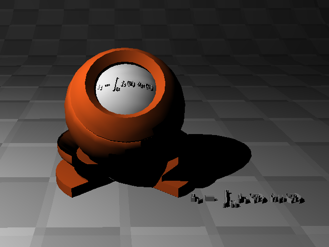
    
No Cel Shading

  

  

    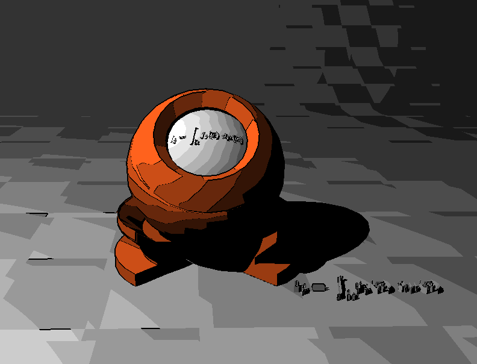
    
Cel Shading Type 1

  

  

    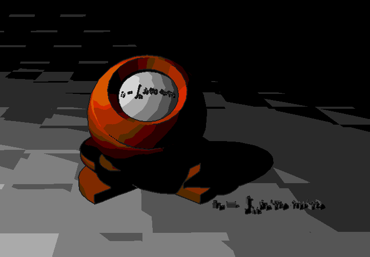
    
Cel Shading Type 2

  

### 3. Bump mapping
To enhance texture richness, bump mapping was employed to add fine wrinkles to Balrog's skin and the surface of the bridge. As noted in the slide and paper, it is necessary to modify the normals of the points within the relevant triangle meshes. 

To achieve this, a tangent calculation method was implemented for each triangle, and the height values would be computed based on the color data from the texture file, which are stored in the height map. The perturbed normals are calculated using the original normal and tangent values. During the rendering step, these perturbed normals would then be utilized.

  

    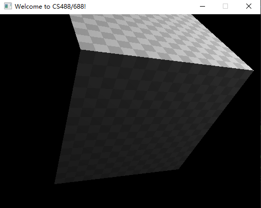
    
Before

  

  

    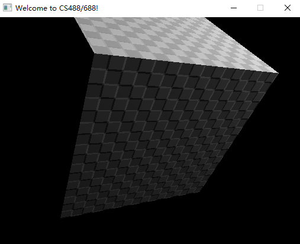
    
After

  

### 4. Fire simulation dynamic
The method implemented combines a particle system with randomness generation. In addition to gravity, a buoyancy force was introduced, which drives the fire particles upwards. This force varies with temperature, so temperature values were stored accordingly. Since both color and lifespan can be determined by temperature, they were not stored separately. 

Simplex noise was applied to introduce randomness into the particles' motion. Furthermore, the color and transparency were controlled by a discrete function to achieve a cartoon style. As the fire dissipates, it must be cleared efficiently; for this purpose, a deque structure was utilized.
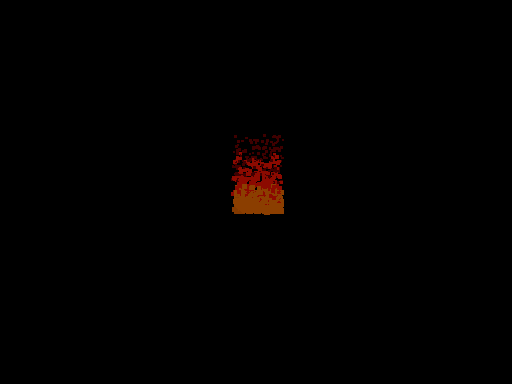

### 5. Fire rendering
Unlike conventional objects, fire emits light. To simulate this, additive blending is applied to the fire particles, allowing the light emitted by each particle to accumulate, thereby replicating the bright and intense nature of fire. 

The particles are rendered with a gradient color based on their age and temperature, transitioning from bright yellow at the base to red, orange, and eventually gray as they cool. 

A glow effect is also implemented to enhance the fire's appearance, increasing its intensity. This is achieved by adding brightness to the surrounding sphere and using the Gaussian blur equation to highlight the surrounding area.

### 6. Smoke rendering
Smoke rendering is managed using a slightly different particle system, with smoke particles generated to have longer lifespans and grow in size as they rise. Alpha blending is applied to ensure smooth transitions and realistic fading. To further enhance realism, volumetric rendering techniques are employed to simulate light scattering and absorption within the smoke. 

Although ray marching was considered for determining the interaction between light and the smoke volume, it was deemed unnecessary; instead, each smoke particle is raytraced, and transparency values are recorded. Shadow handling is effectively implemented in the code, accurately reflecting the transparency of the smoke.
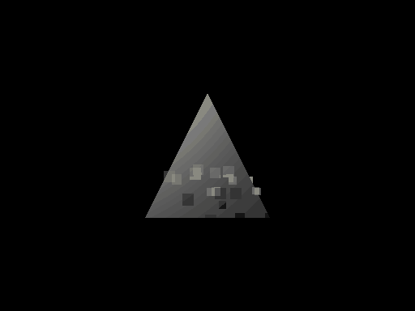

### 7. Elastic object dynamics
A mass-spring system or finite element method was implemented to simulate the forces and reactions within elastic objects. This approach enables the whip to stretch, compress, and bend in response to applied forces. The algorithm updates the positions and states of the mass points or mesh vertices in real time, ensuring accurate and natural-looking deformations.
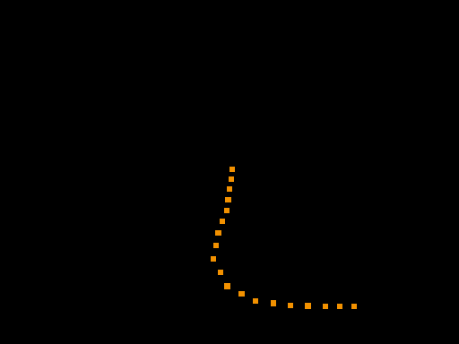

### 8.Shadow mapping
To enhance the existing shadow mapping technique, the shadow mapping method was employed, which involves generating depth maps from the perspective of the light sources and utilizing these maps during rendering to identify shadowed areas.

Techniques such as percentage-closer filtering (PCF) were applied to soften shadows and minimize artifacts, resulting in smoother and more natural shadow appearances. While the initial rendering of the shadow map requires time, the process is faster than ray-tracing shadows in subsequent frames.
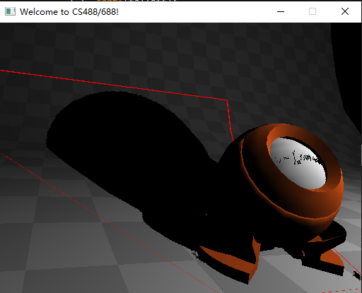

## Final result
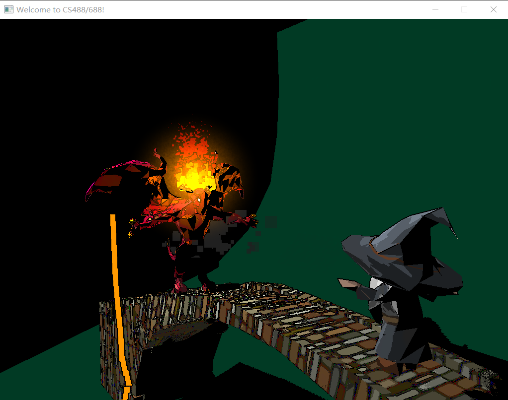
