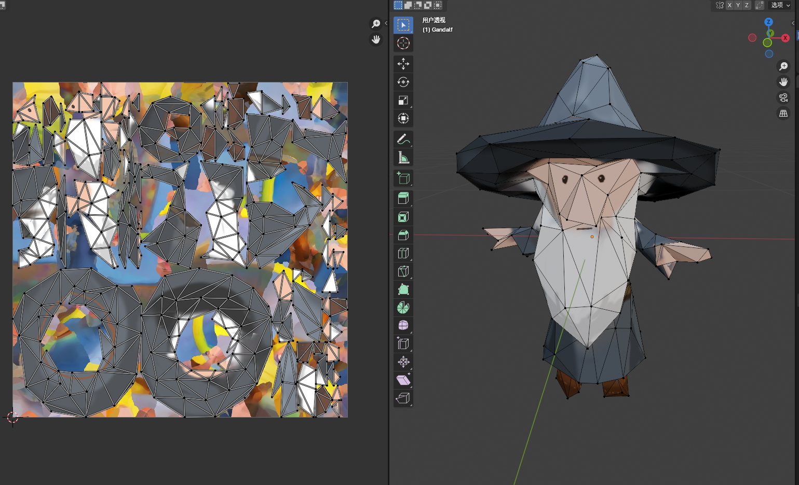
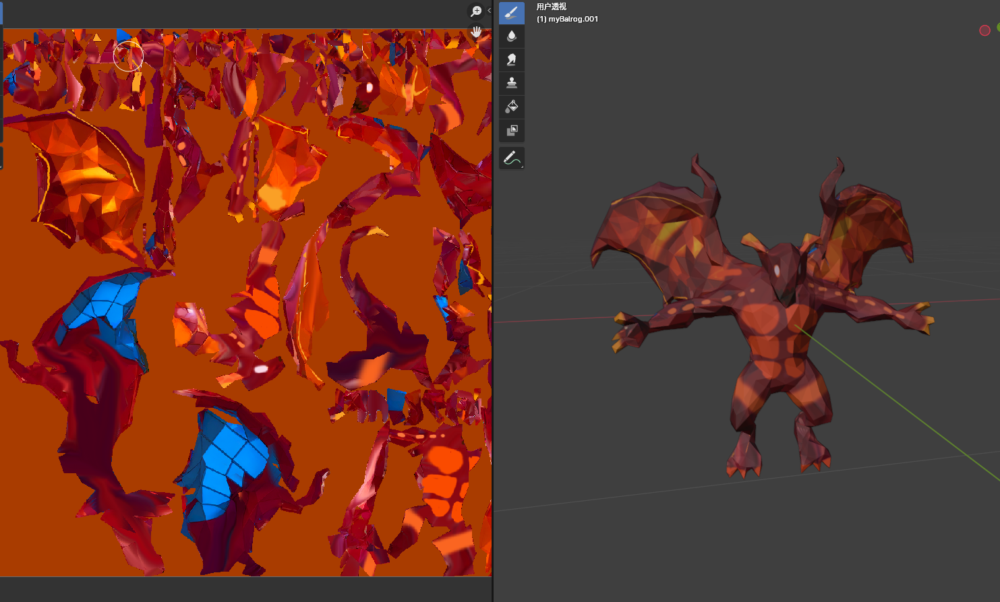

## Implementation:

### Modeling
I used Blender to model two characters and their weapons, and also created the texture maps for both.

### Cel Shading
I implemented edge detection to emphasis the 2D effect, 
the sensitiveness is customized in code.I also used SED to quantize the value of light. Feel
free to play around with ''lightingLevels'' and "edgeThreshold" to see variations.

3. Bump mapping: To increase the richness of texture, I used bump mapping to add small
wrinkles to Balrog's skin and the texture of bridge. As mentioned in the slide and
the paper, we need to modify the normal of the points inside the related triangle meshes. To
do so, implemented tangent calculation method for each triangle,and also 
do calculation the height based on the color provided in the texture file, and store them in the height
map. Then, I use the old normal and tangent values to calculate the perturbed normal. Finally,
during the rendering step, we use perturbed normal.

4. Fire simulation dynamic: The method I chose to implement is the combination of particle
system and randomness generation. More specifically, I adopt the particle system in the
existing code. In addition to Gravity, I also added a Buoyancy force, which is the force that
drives the fire particles upwards. Note it changes with the temperature, so we would store the
temperature as well. As the color and lifespan can be determined by temperature, I choose not to
save them. Then, I would add either the Simplex noise function to
add randomness to particles' motion. In addition, the color/transparency would be determined
by a discrete function, to achieve the cartoon style. Note the fire faded away and we need to clear
that, I use deque structure to increase efficiency.

5. Fire rendering: Unlike conventional objects, fire emits light. To achieve this, I will use additive
blending for fire particles, allowing the light emitted by each particle to accumulate, simulating
the bright and intense nature of fire. The particles will be rendered with a gradient color based
on their age and temperature, transitioning from bright yellow at the base to red, orange, and
finally to gray as they cool down. Additionally, I will implement a glow effect to enhance the
appearance of the fire, making it appear more intense and fiery. More specifically, I do so in
surronding sphere, add brightness to them, and also use the Gaussian blur equation to highlight
the surrounding area as well.

6. Smoke rendering: Smoke rendering is handled using a slightly different particle system,
as smoke particles will be generated with longer lifespans and will grow in size as they rise. I
used alpha blending to render smoke particles, ensuring smooth transitions and realistic fading.
To enhance realism, I implemented volumetric rendering techniques to handle light scattering
and absorption within the smoke. I wanted to use ray marching here to determine the interaction
of light and volume, but it is not worthy, I just raytrace each smoke particle and recorded
transparency value. Note that the shadow is well-handled in my code, so that it also shows
the transparency of the smoke.

7. Elastic object dynamics: I implemented a mass-spring system or a finite element method to simulate the forces
and reactions within elastic objects. This will allow the whip to stretch, compress, and bend in
response to applied forces. The algorithm update the positions and states of the mass points
or mesh vertices in real time, ensuring accurate and natural-looking deformations.

8. Shadow mapping: To improve the current shadow mapping method, I used the shadow
mapping method. This involves creating depth maps from the perspective of the light sources
and using these maps during rendering to determine shadowed areas. I also used techniques like
percentage-closer filtering (PCF) to soften shadows and reduce artifacts, ensuring that the shadows
appear smooth and natural. Note it takes time to render the shadow map at the beginning,
but after this, it is faster than ray-tracing shadow.

